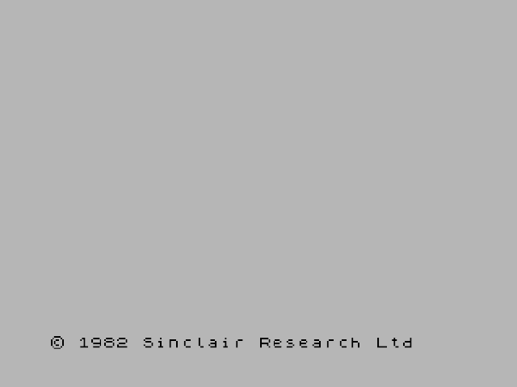
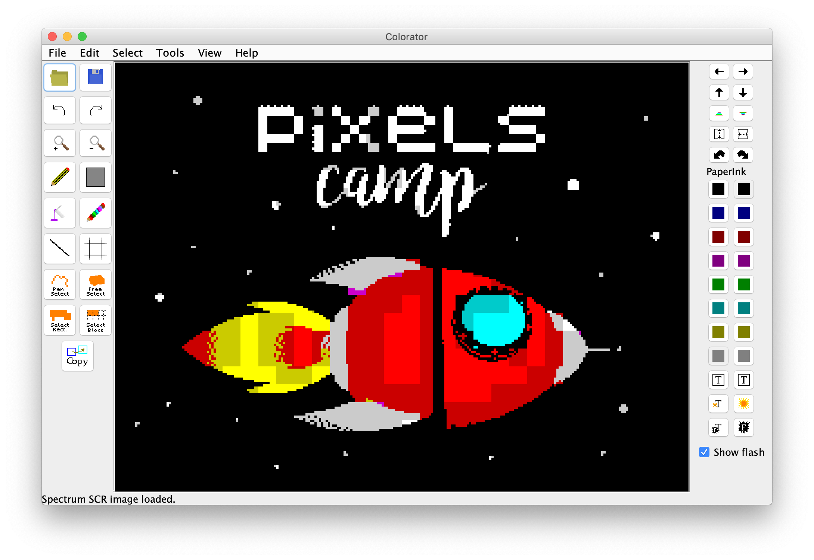

ZX Pixels
=========

ZX Spectrum 48K program, as part of the Pixels Camp v3.0 t-shirt [challenge][0].



## Instalation

First install the [ZXBasic][1] toolkit as a subdirectory of this repo (don't worry, it's .gitignored):

```
git clone https://github.com/boriel/zxbasic
cd zxbasic
sudo easy_install .
./zxb.py
cd ..
```
Documentation for ZXBasic can be found [here][2].

Install [ZX80Asm][3].

```
brew install z80asm
```

If you use the [Vim editor][14], then this Z80 syntax [plugin][4] is handy.

## Building

We have a [Makefile][11] with everything you need to build pixels.tzx. Just type:

```
$ make
```

The binaries are in the build/ sub-directory.

## Graphics

The [Colorator][6] graphics editor works fine and allows you to import PNG files, paint them, and then export [SCR][5] screens.

Colorator requires Java. If you're on a Mac, this is now the best and cleanest way to install (and later remove) Java:

```
brew update
brew cask install java
```



## Tools

I've coded this tiny NodeJS [tool][7] that converts a [.SCR][5] file from [Colorator][6] into an includable [screen.bas][screens/rocket.bas] buffer, which can then be loaded directly to screen using this [assembly code][lib/putchars.bas].

To use:

```
$ ./tools/convert.js screens/screenshot.scr > screens/screenshot.bas
```

## Emulator

[Fuse][8] is a great ZX Spectrum emulator. OSX version [here][10].

Install, run it, and open the [pixels.tzx][10] to run this program.

Alternatively, you can use this ZX Spectrum emulator [in Javascript][18] and open [this URL][17] using the **load from web** feature.

## Credits

[Isa][16] did all the SCR graphics.

## Useful docs

* [SCR file specfications][5]
* [ZXBasic manual][2]
* ZX Spectrum screen layout [part 1][12] and [part 2][13]
* [TZX format][15]

[0]: https://killmaster.github.io/2019/03/24/the-tshirt-challenge
[1]: https://github.com/boriel/zxbasic
[2]: http://www.boriel.com/wiki/en/index.php/ZXBasic
[3]: https://www.nongnu.org/z80asm/
[4]: https://github.com/cpcsdk/vim-z80-democoding
[5]: http://www.zx-modules.de/fileformats/scrformat.html
[6]: https://github.com/yomboprime/colorator
[7]: https://github.com/PixelsCamp/tshirt-gate/blob/master/2019/zxspectrum/tools/convert.js
[8]: http://fuse-emulator.sourceforge.net/
[9]: https://fuse-for-macosx.sourceforge.io/
[10]: https://github.com/PixelsCamp/tshirt-gate/raw/master/2019/zxspectrum/releases/pixels.tzx
[11]: https://github.com/PixelsCamp/tshirt-gate/blob/master/2019/zxspectrum/Makefile
[12]: http://www.overtakenbyevents.com/lets-talk-about-the-zx-specrum-screen-layout/
[13]: http://www.overtakenbyevents.com/lets-talk-about-the-zx-specrum-screen-layout-part-two/
[14]: https://www.vim.org/
[15]: https://www.worldofspectrum.org/TZXformat.html
[16]: https://github.com/isacosta
[17]: https://raw.githubusercontent.com/PixelsCamp/tshirt-gate/master/2019/zxspectrum/releases/pixels.tzx
[18]: https://jsspeccy.zxdemo.org/
